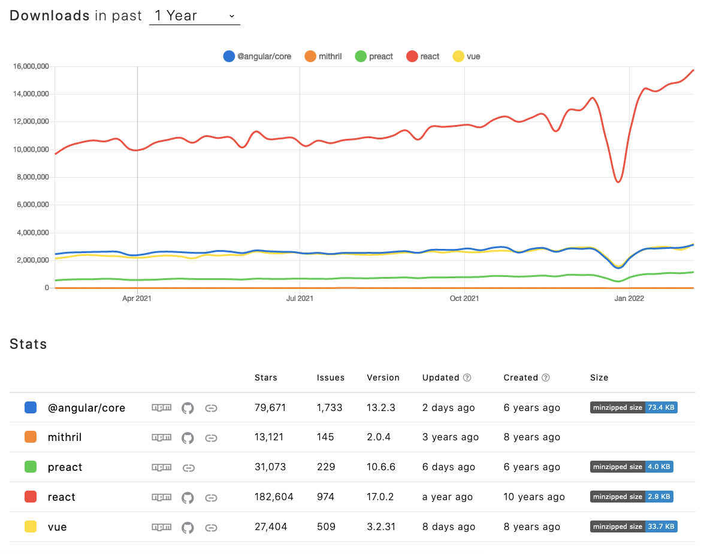
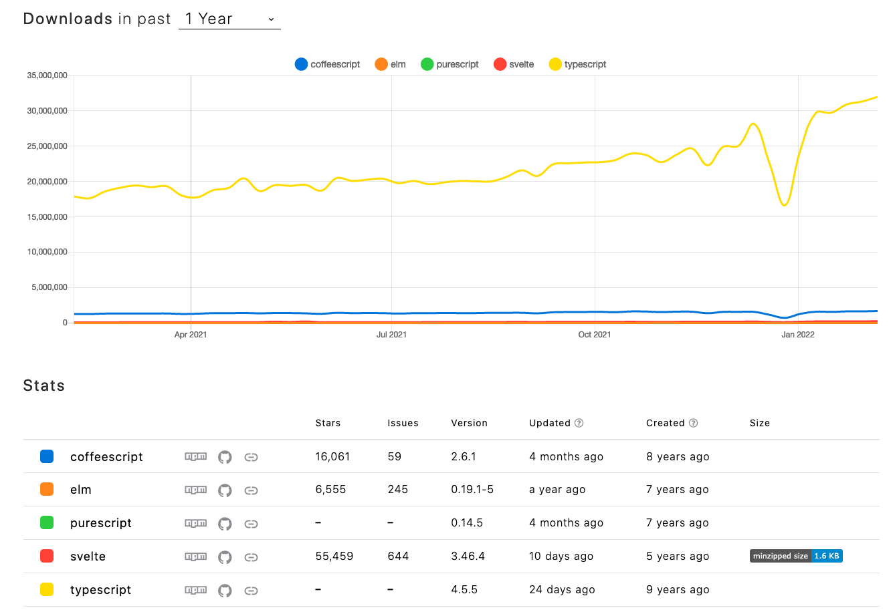
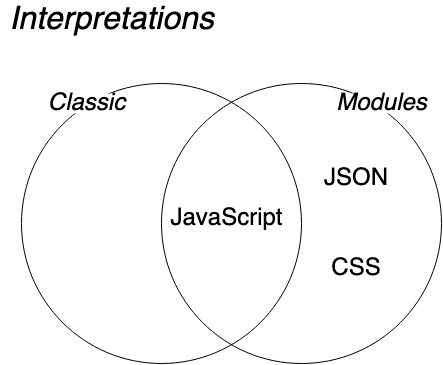
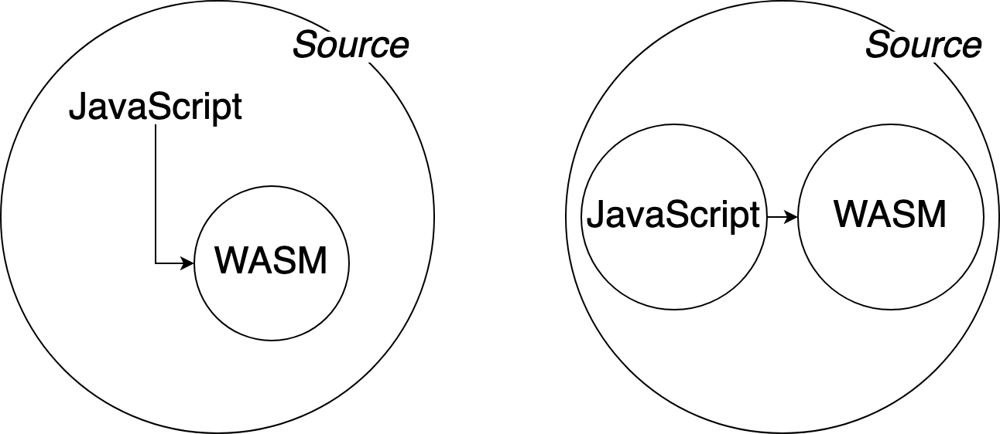

# Development in the Browser, for Programmers

This not-so-new-fangled web thing has staying power. Technologies like [Wasm](https://www.w3.org/wasm/), [Web Workers](https://html.spec.whatwg.org/multipage/workers.html), [Streams](https://streams.spec.whatwg.org/), [WebGL](https://developer.mozilla.org/en-US/docs/Web/API/WebGL_API), and [Web Audio API](https://www.w3.org/TR/webaudio/) are stabilizing while userland frameworks like [QT](https://www.qt.io/), [Electron](https://www.electronjs.org/), [Unity](https://unity.com/), and [React Native](https://reactnative.dev/) bridge web and native platforms. Naturally, the browser is an interesting space for developers from non-Web fields. But when backend rockstars, folks who pride themselves as "real programmers", develop their first crossover hit, they struggle to embrace the browser platform. I hear developers say, "Let me skip this altogether!"

I approached the first drafts of this article as a lover of JavaScript, defender of browser API 🦸‍♀‍. I'm different and cool. I respect the hard work that goes into frontend development. I've even read [Joe Query's take on the self-hating web developer.](https://joequery.me/code/the-self-hating-web-developer/) I had a chip on my shoulder. In the pretend hierarchy of real programmers, frontend developers are near the bottom, so it felt important to defend browser applications. "It's _real_ programming too, darn it!"

My therapist tells me the cross-pollination of development fields in the browser highlights existing and new needs for this platform. My homework is to synthesize existing knowledge into a holistic crash course on HTML and Web scripting. After establishing the basics, we will look at future changes to the browser platform. My hope is the browser provides for the requirements of all web software.

This text borrows heavily from The Web Hypertext Application Technology Working Group (WHATWG) specification:

- [HTML scripting](https://html.spec.whatwg.org/multipage/scripting.html)

## "Real" programmers don't do this

### 1. learn JS or JS Browser API

"Real" programmers write in their preferred language (C, C++, Rust). They use Wasm as a compiler target and expect a first-class experience. Time is lost when developers must port code or learn new programming languages. "Fake" programmers hold onto cocky self-assuredness-- knowing refusal to learn a programming language is a shallow excuse-- while recognizing the value of exchanging cognitive overhead for code isomorphism.

### 2. install JS frameworks to accomplish their task.

"Real programmers" use their preferred frameworks knowing it's silly to suggest framework dependency is unique frontend baggage.

Tasks like interacting with the document API or writing quality HTML carry taboo. Only half-jokingly, I suspect nobody wants to think about the browser. Historically, JS runtimes are inconsistent and feature support varies between browser vendors and versions. Out of necessity, frontend developers also turn to frameworks to patch discrepancies:

<figure>



<figcaption>

[Made with npmtrends](https://www.npmtrends.com/@angular/core-vs-preact-vs-react-vs-vue-vs-mithril)

</figcaption>
</figure>

The figure suggests many frontend projects rely on complex web frameworks to build the view layer. Frontend developers have also contributed resources to improve dependency distribution and bloat:

- [Web Components](https://github.com/WICG/webcomponents)
- [Bundlephobia](https://bundlephobia.com/)
- [unpkg](https://unpkg.com/)

### 3. re-write JavaScript boilerplate ad nauseam 🤢

As we'll cover later, the tasks "real" programmers want to accomplish produce lots of JavaScript boilerplate and rely on "glue" to function. Frontend frameworks suggest we are gluttons for repetition, but the declarative and functional approaches of modern web development are well-established for reasons, some of them valid but too lengthy to cover now.

### 4. sacrifice type safety 🦺

Nobody will claim compiled code can run without error, but "real" programmers need to use their existing knowledge and preferred compiler to make assertions about the safety of their application.

JS compilers and transpilers are downloaded approximately 30 million times a day. Frontend developers are looking for alternatives too:

<figure>



<figcaption>

[Made with npmtrends](https://www.npmtrends.com/coffeescript-vs-elm-vs-purescript-vs-typescript-vs-svelte)

</figcaption>
</figure>

## Re-learn the `<script>` element

The Hypertext Markup Language (HTML) [script](https://html.spec.whatwg.org/dev/scripting.html) element landed in the HTML 4.01 specification, released on December 24, 1999. [Click here to read the original specification.](https://www.w3.org/TR/html401/interact/scripts.html) While the browser loads the document, it pauses on `<script>` elements to evaluate the associated script. A "script" was defined as:

> A client-side script is a program that may accompany an HTML document or be embedded directly in it. The program executes on the client's machine when the document loads, or at some other time such as when a link is activated.

Presently, scripts come with a warning:

> Authors are encouraged to use declarative alternatives to scripting where possible, as declarative mechanisms are often more maintainable, and many users disable scripting.

Xah Lee has been compiling the history of the `<script>` element and provides better detail. His website is NOT available over HTTPS but nothing is asking for personal details. [Use your judgment and read more here](http://xahlee.info/w/history_of_script_tag.html).

Developers can provide several `<script>` attributes to affect how their JS is interpreted.

<figure>


<figcaption>
A schematic diagram from WHATWG spec summarizing how scripts are interpreted.

[Originally available here](https://html.spec.whatwg.org/multipage/scripting.html#the-script-element)

</figcaption>
</figure>

### `type`

For the sake of explanation, we say there are two flavors of scripts: (1) classic scripts and (2) module scripts. In 2022, modules are also available in additional flavors:

<figure>



<figcaption>

Given:

- Interpretations, `U = { C, M, ... }`,
- Classic, `C = { JavaScript }`, and
- Modules, `M = { JavaScript, JSON, CSS }`

JavaScript is the intersection of classic scripts and module scripts, `C∩M = { JavaScript }`

</figcaption>
</figure>

Clumsily, I define "Classic" scripts by defining the newer "Module" scripts instead. [To the runtime, the difference is in semantics](https://tc39.es/ecma262/#sec-source-text-module-records), but developers have higher-level concerns:

- Modules may import from other modules
- Strict mode is enabled by default, similar to prepending `"use strict";` to every JavaScript file.
- A module's top-level declarations do not pollute the global scope
- Also there's some new syntax and junk requiring 5,000 lines of code to fully illustrate. It's at least good enough that NodeJS seems to be migrating away from CommonJS.

The `type` attribute accepts 3(ish) values so the developer can declare the flavor of JS interpretation:

1. `type` attribute is not present `<script>`, or `type` is an empty string `<script type="">`. The script element declares its JS is classic. Because both approaches declare identical behavior, this is the previously counted "ish."
1. `type` case-insensitively matches the ASCII string `"module"`, e.g. `<script type="module">` or `<script type="MoDuLe">` if you want to test your luck and browser adherence to spec. The script element declares its JS is a module script.
1. `type` is literally ANYTHING else, e.g. `<script type="literally ANYTHING else">`. This is a "data block" and we won't check a glossary to feign familiarity. The script's source will not be evaluated.

### `src`

> [Scripts] can be embedded inline, or be imported from an external file using the src attribute

<figure>



<figcaption>

A JavaScript source may also include or reference an additional Web Assembly (Wasm) source. Wasm will be covered in more detail later.

</figcaption>
</figure>

### `async`

`async` may be declared by Classic scripts using the `src` attribute and Module scripts. When present, the `async` attribute indicates the browser may fetch the script "in parallel to parsing" to be "evaluated as soon as it is available (potentially before parsing completes)."

### `defer`

`defer` may only be declared by Classic scripts using the `src` attribute. When present, the `defer` attribute indicates the script should not be evaluated until the document is parsed.

### An aside regarding hosting

As of this writing, the following requirements must be met for web applications using module scripts and scripts containing Wasm binary code:

- An HTML document is the entry point for script loading
- Classic and Module JS scripts fetch and instantiate Wasm
- HTML, JS, and Wasm files are available over HTTP

A web host is required to (1) [respect `Same-origin` policy](https://developer.mozilla.org/en-US/docs/WebAssembly/Concepts#webassembly_goals) for fetching Wasm and (2) [import ES modules](https://developer.mozilla.org/en-US/docs/Web/JavaScript/Guide/Modules#other_differences_between_modules_and_standard_scripts). To bypass `Same-origin` at the expense of modules, very small Wasm modules can be 'inlined' as UInt8 buffers.

## Say, "Hello, world!"

Like all good tutorials, we move on from the definitions and write "Hello, world!" to the console. We load the following HTML and script in our browser:

```html
<!DOCTYPE html>
<html>
  <script>
    console.log("Hello, world!")
  </script>
</html>
```

While the document is parsed, our classic script is interpreted as a [top-level production](https://tc39.es/ecma262/#sec-notational-conventions), and the runtime executes the JS bytecode. We see something like this in the console:

```
> "Hello, world!"
```

### How did that work?

Our current understanding is sufficient to develop scripts, but sometimes it's satisfying to look "under the hood." From the Mozilla Developer Network (MDN), here are the highlights of our runtime:

> A call stack is a mechanism for an interpreter... to keep track of its place in a script that calls multiple functions - [MDN call stack](https://developer.mozilla.org/en-US/docs/Glossary/Call_stack)

> Async operations like promises are put into an event queue, which runs after the main thread has finished processing so that they do not block subsequent JavaScript code from running. The queued operations will complete as soon as possible then return their results to the JavaScript environment. - [MDN asynchronous JS](https://developer.mozilla.org/en-US/docs/Learn/JavaScript/Asynchronous/Introducing#the_event_queue)

> JavaScript has a runtime model based on an event loop, which is responsible for executing the code, collecting and processing events, and executing queued sub-tasks. - [MDN event loop](https://developer.mozilla.org/en-US/docs/Web/JavaScript/EventLoop)

<figure>


<figcaption>

[A visual representation of the JS runtime, created by the Mozilla Developer Network.](https://developer.mozilla.org/en-US/docs/Web/JavaScript/EventLoop#visual_representation)

</figcaption>
</figure>

For more specificity, WHATWG provides us [Event loops definitions](https://html.spec.whatwg.org/multipage/webappapis.html#event-loops):

> To coordinate events, user interaction, scripts, rendering, networking, and so forth, user agents must use event loops... Each agent has an associated event loop, which is unique to that agent.

> The event loop of a similar-origin window agent is known as a window event loop. The event loop of a dedicated worker agent, shared worker agent, or service worker agent is known as a worker event loop. And the event loop of a worklet agent is known as a worklet event loop.

Frontend developers (correctly) say scripts are "single-threaded" because threading is abstracted by an event loop. For simplicity, the "main" thread represents the default event loop where the runtime evaluates scripts. Going forward, we will say the "default event loop" is a platform-agnostic main thread, and the "window event loop" is a browser-specific main thread.

Highlights of our runtime:

1. The runtime uses an event loop to execute scripts as though they were single-threaded
1. Synchronous operations always block evaluation
1. Asynchronous operations never block evaluation. Async is different from Futures because the loop is never halted
1. Developers create and extend async behavior using promises or runtime-specific APIs like timers, fetch, or storage. Language features like `async` or `yield` and generators give developers the primitives to express complex async logic.
1. Parallelism can only be introduced with additional event loops, i.e. Web Workers

## Get weird with the runtime

If readers politely assume the previous "Hello, world!" example executed, then I certify us, runtime experts. We've deployed the foundational technology of modern, browser applications. To keep things exciting, let's introduce two additional technologies:

### 1. Workers

Great care is made to avoid blocking tasks, tasks that are synchronous and halt crucial function calls like DOM updates. Sometimes a feature of an application is not relevant to the default loop, for example, long-running tasks, network behavior, persistent storage, or stream processing. From the [Web workers specification on WHATWG](https://html.spec.whatwg.org/multipage/workers.html):

> [Workers are] for running scripts in the background independently of any user interface scripts. This allows for long-running scripts that are not interrupted by scripts that respond to clicks or other user interactions, and allows long tasks to be executed without yielding to keep the page responsive... Generally, workers are expected to be long-lived, have a high start-up performance cost, and a high per-instance memory cost.

To create and start the first web worker from the default loop, we simply pass the URL of a script to the `Worker` constructor:

```javascript
const hardWorker = new Worker("worker.js")
```

`hardWorker` now runs in a separate, worker event loop from the calling script and can conveniently instantiate additional workers. The only interface between workers, and thus event loops, is an event-based messaging API. The return value of the worker constructor provides an API to post messages to the worker and event emitters to receive errors and messages.

### 2. WebAssembly (Wasm)

[From the WebAssembly Working Group](https://www.w3.org/wasm/):

> [Wasm] is a binary instruction format for a stack-based virtual machine. Wasm is designed as a portable target for compilation of high-level languages...

> The mission... is to standardize a size- and load-time-efficient format and execution environment, allowing compilation to the web with consistent behavior...

Developers must use the JS [WebAssembly Web API](https://www.w3.org/TR/wasm-web-api/) to load and instantiate Wasm binary code into the runtime. As a result, the JS and Wasm codes are predictably executed on the same event loop.

Wasm might be included in a script because:

- it's represented as a compact, low-level code for fast parsing and interpretation compared to JS
- Wasm performance is predictable, Wasm is cross-platform
- the inclusion of a Wasm compiler step lets developers make assertions about their code, e.g. type safety, using their preferred language and tools

Developers should not choose Wasm for:

- speed

The simplest example of loading Wasm is provided [here by MDN](https://raw.githubusercontent.com/mdn/webassembly-examples/master/js-api-examples/instantiate-streaming.html):

```html
<!DOCTYPE html>
<html>
  <head>
    <meta charset="utf-8" />
    <title>Wasm instantiateStreaming() test</title>
  </head>
  <body>
    <script>
      var importObject = { imports: { imported_func: arg => console.log(arg) } }

      WebAssembly.instantiateStreaming(fetch("simple.wasm"), importObject).then(
        obj => obj.instance.exports.exported_func()
      )
    </script>
  </body>
</html>
```

## Design a modern, browser application

Having covered the basics, we will design a modern, browser application. We begin with these assertions about our application and platform:

1. A web host serves HTML, JS, and Wasm files
1. Developers use JS to load and instantiate Wasm into the calling script's loop. This is available on the default loop and in worker loops.
1. The only way to introduce parallelism to a script is by creating the first Web Worker from the default loop.
1. Workers can create other workers
1. Workers can ONLY communicate through a scheduled messaging API
1. Only the window loop may access the DOM or Shadow DOMs
1. Wasm cannot interact with any high-level API

### Software design pain points

Earlier, I bogusly claimed what real developers do and don't do. To re-summarize:

1. Write JS
1. Use frameworks (There's nothing worth re-analyzing for this pain point)
1. Re-write boilerplate
1. Sacrifice type safety

Thankfully, Wasm and web spec contributors are hard at work. Proposals have been authored to remove these pain points.

#### Wasm Modules

Post-MVP [Wasm proposal 12](https://github.com/WebAssembly/proposals/issues/12) supports loading Wasm as a fully-featured module. Assuming adoption, developers can safely load Wasm modules with, or without, JS.

Wasm module loading:

```html
<script type="module" src="foo.wasm">
```

```javascript
import "foo.wasm"
```

#### Wasm High-Level API

Since the Document API is not exposed to Wasm, we use JavaScript "glue" to interface with high-level API, for example, to update the document. Fetch, Navigator, Audio, XHR, Promise, setTimeout, and so on until the example is made are also unexposed. Wasm cannot interact with any high-level API! "Real" programmers must learn to apply the JS foot gun safety that their frontend colleagues have been practicing. The runtime cannot provide type safety, and no amount of "flavor of the week"-to-JS compilation will fix that.

For thorough understanding, Lin Clark wrote [this AMAZING article](https://hacks.mozilla.org/2019/08/webassembly-interface-types/) detailing how Wasm interacts with the browser and runtime.

## Follow along

Ideally, readers now have the resources to understand or learn more about the current JS runtime. They know how Wasm is integrated into the JS runtime and the current limitations of that system.

- Wasm modules proposal, [ticket 12](https://github.com/WebAssembly/proposals/issues/12)
- Wasm makes no assumptions about the environment because it is a cross-platform binary code. See Wasm [ticket 71](https://github.com/WebAssembly/proposals/issues/71).
- Wasm needs a Garbage Collector before higher-level APIs like Document can be exposed. See Wasm [ticket 1184](https://github.com/WebAssembly/design/issues/1184) and [ticket 1079](https://github.com/WebAssembly/design/issues/1079).
- "A long-standing source of friction between WebAssembly and the rest of the Web platform... is that calling Web APIs from WebAssembly usually requires thunking through JavaScript which hurts performance and adds extra complexity for developers..." - [The Wasm Web IDL proposal](https://github.com/WebAssembly/interface-types/blob/main/proposals/interface-types/Explainer.md#web-idl-integration)
