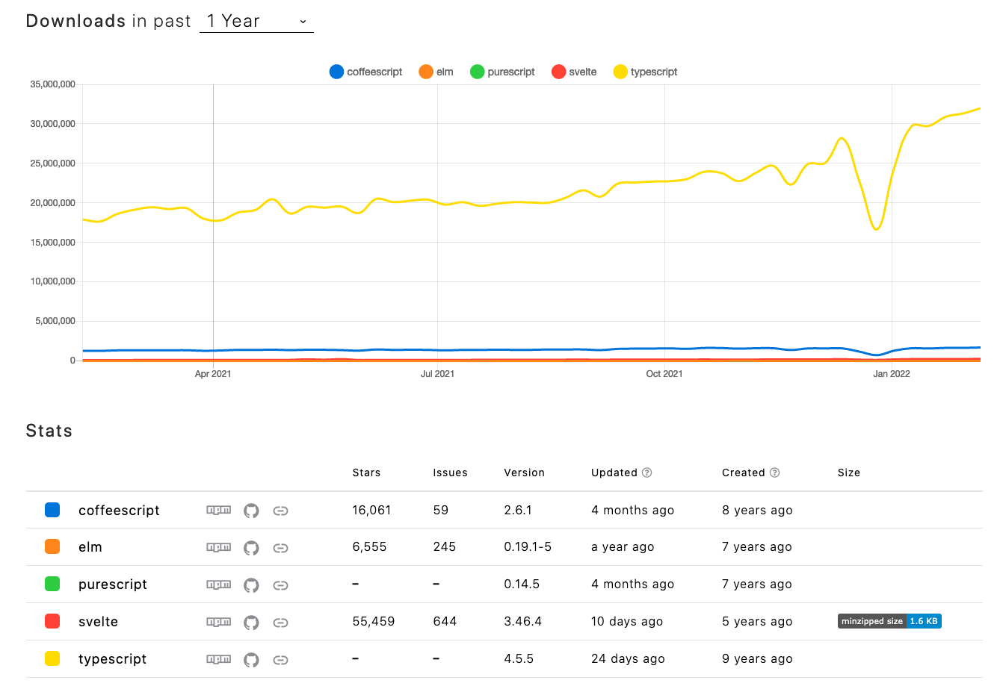

## Building the document with WASM

### Trouble's a brewin'

I see friction between backend and frontend devs in the browser. This new-fangled web thing has staying power. Technologies like WASM, Streams, WebGL, Audio API, and Workers are stabilizing while userland frameworks like QT, Electron, Unity, and React Native bridge web and native platforms. But while backend rockstars develop their first crossover hit, they struggle to embrace the rest of the browser.

Folks who pride themselves as “real” programmers are thrown into a field where their ineptitude shows, and nothing in their toolbox is specialized for the new tasks. Instead, I hear backend devs say, "Let me skip this JS crap altogether!"

### "Real" programmers want to...

- write code in their preferred language (Rust, C, C++)
- use WASM as a (mostly) fully-featured compiler target
- run their web application with a first-class experience

### "Real" programmers don't want to...

1. learn JavaScript and JS Browser API
1. install JS frameworks to accomplish their task. Their last operating system ran on a nail wrapped in copper wire with 3 potatoes of memory. (And nothing was ever allocated to the 3rd potato.) 🥔🥔🥔
1. re-write JavaScript boilerplate ad nauseam to fetch WASM and run web workers 🤢
1. sacrifice type safety 🦺

### We all want the same things

In the pretend hierarchy of real programmers, web developers are near the bottom. I started this piece very confident as a lover of JavaScript, defender of browser API 🦸‍♀‍. I'm different and cool. I respect the hard work that goes into frontend development. I've even read [Joe Query's take on the self-hating web developer.](https://joequery.me/code/the-self-hating-web-developer/)

Let's park that train of thought in the yard because these requirements from "real" programmers are reasonable and familiar to frontend devs:

| Things "real" programmers don't want to do...      | sound familiar to frontend developers                                                                                                                                                                                        |
| -------------------------------------------------- | ---------------------------------------------------------------------------------------------------------------------------------------------------------------------------------------------------------------------------- |
| 1. learn JavaScript and JS Browser API             | ["I love the DOM but most developers would rather jump off a bridge than write some logic to walk a DOM."](https://news.ycombinator.com/item?id=29943444)                                                                    |
| 2. install JS frameworks to accomplish their task. | [Bundlephobia](https://bundlephobia.com/)                                                                                                                                                                                    |
| 3. re-write JavaScript boilerplate ad nauseam      | (Actually we're gluttons for repetition.)                                                                                                                                                                                    |
| 4. sacrifice type safety                           | The frontend community is so worried about developing in JS that we could sing annual dirges for the JS-a-likes that have come and gone. JS compilers and transpilers are downloaded approximately 30 million times a month. |



[Made with npmtrends](https://www.npmtrends.com/coffeescript-vs-elm-vs-purescript-vs-typescript-vs-svelte)

### The current landscape

As of this writing, the following requirements must be met by web application software running WASM:

1. One HTML document to load JavaScript
1. JavaScript is served or embedded to fetch and instantiate WASM
1. JavaScript is used to apply additional updates to the HTML document
1. Optionally, JS can run JS and WASM modules in separate workers off the main call stack

Additionally, a web host must serve the HTML, JS, and WASM files over HTTP. A web host is required to (1) [respect `Same-origin` policy](https://developer.mozilla.org/en-US/docs/WebAssembly/Concepts#webassembly_goals) for fetching WASM and (2) [import ES modules](https://developer.mozilla.org/en-US/docs/Web/JavaScript/Guide/Modules#other_differences_between_modules_and_standard_scripts). To bypass `Same-origin` at the expense of modules, very small WASM modules can be 'inlined' as UInt8 buffers.

### An ES module by any other name

A post-MVP [proposal](https://github.com/WebAssembly/proposals/issues/12) was made in 2018 to support loading WASM with the same tools as loading [es6 modules](https://tc39.es/proposal-dynamic-import/). Assuming adoption, developers can safely load WASM modules and execute bytecode on the main call stack without JS. Noice! JS pain points 1, 2, and 4 have been removed from the current landscape.

Module loading:

```html
<script type="module" ...>
```

```javascript
import "..."
```

### But can I "Hello, world!"?

In the current landscape, we require more JavaScript glue to apply additional updates to the HTML document. The Document API is not exposed to WASM. Neither is fetch, Navigator or any other browser API that frontend developers rely on. WASM makes no assumptions about the environment because it is a cross-platform bytecode. This [WebAssembly ticket](https://github.com/WebAssembly/proposals/issues/71) follows a similar conversation between a contributor and a developer.

Let's talk more about that tasty, tasty glue. Rust developers may be familiar with the `wasm-bindgen` crate which includes the `web-sys` feature. These bind WASM and web API types to rust code, allowing developers to develop against APIs like `window` and `Navigator`. At runtime, a JS shim proxies calls between the WASM bytecode and JS API. As a result, developers can only assert their WASM is safe, but the other side of the JS boundary is unsafe. (I'm sorry to report no JS compiler will fix this either.)

Thankfully, some folks are hard at work on a solution:

> A long-standing source of friction between WebAssembly and the rest of the Web platform (and the original motivating use case for this proposal) is that calling Web APIs from WebAssembly usually requires thunking through JavaScript which hurts performance and adds extra complexity for developers. [continue reading](https://github.com/WebAssembly/interface-types/blob/main/proposals/interface-types/Explainer.md#web-idl-integration)

In the future, the `web-sys` feature may not require the JS shim. Instead, `wasm-bindgen` will bind directly to the same internal API as the JS runtime using the `web-idl-integration`.

### One loose thread

It feels important to cover concurrency in the browser. I don't make it through a single day without using generators, promises, callbacks, and all the syntactic sugar that helps the medicine go down. And still, when I first started chewing on these problems, I panicked! How are we going to handle concurrent rendering? Won't someone think of the workers? I sat out to prove there were risks with handing the DOM over to WASM. 30 seconds later my brain re-engaged.

Let's review the highlights of the JS call stack so nobody else feels as silly as me:

1. JavaScript is single-threaded. All operations go on a call stack.
1. Synchronous operations always block
1. Asynchronous operations never block. `await` (syntax sugar on promises) and `yield` are not comparable to futures because the 'thread' (call stack) immediately continues in JS. "Don't block the DOM" is a web developer mantra.
1. Asynchronous behavior comes from outside the system in the form of events, e.g. a WebSocket message, and callbacks, e.g. request animation frame.
1. The developer can create or extend asynchronous behavior using callbacks, promises, and (usually) timer API.
1. The only way to introduce parallelism into the application is by creating the first Web Worker from the main thread. (See this excellent [blog post](https://nolanlawson.com/2015/09/29/indexeddb-websql-localstorage-what-blocks-the-dom/) about how most storage API implementations were blocking.)
1. Workers can create other workers
1. Workers can ONLY communicate through a scheduled messaging API
1. Workers do not have direct access to the DOM

QED, scheduling has been provided by the runtime. Even in the future of WASM modules, a glorious land with no JS, we can safely write 'Hello, world!' from our main WASM module while offloading larger or asynchronous compute to other threads.

I think we just ditched JavaScript.
